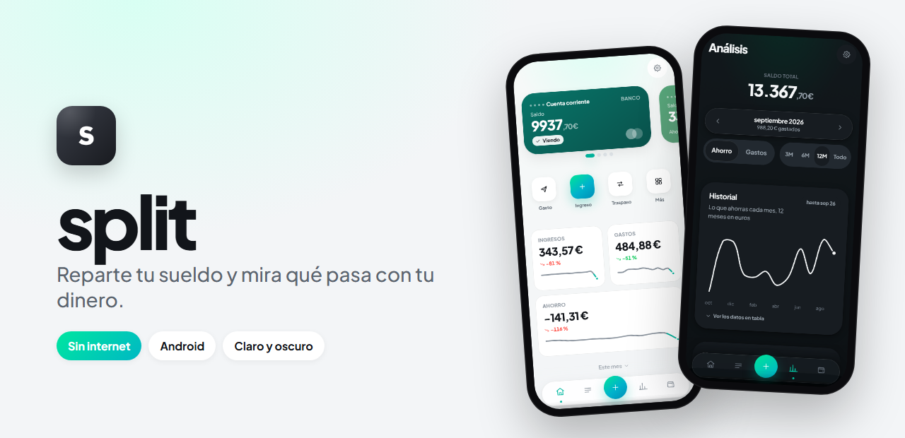
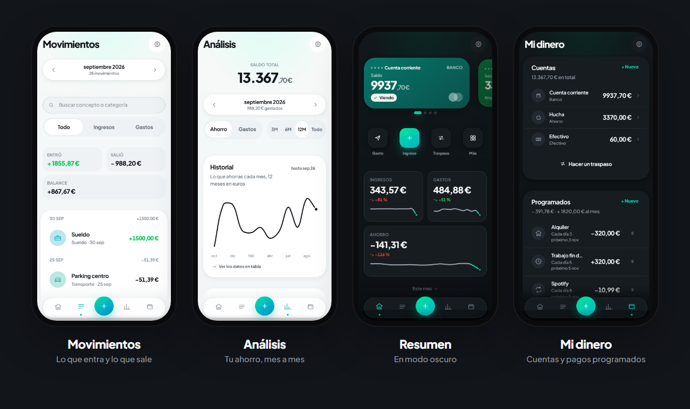

<a href="https://dripdev.dev"></a>

<p align="center">
  
</p>

<p align="center">
  <a href="https://github.com/roblesgg/split/releases/latest"></a>
  
  
</p>

**split** te dice en diez segundos cómo vas este mes. Repartes el sueldo en apartados, apuntas lo que gastas y la app te enseña la cifra que importa, en grande.

**Nada sale de tu móvil.** Sin cuentas, sin servidores, sin anuncios.

<p align="center">
  
</p>

## Qué puedes hacer

| | |
|---|---|
| 🛒 **Apuntar en tres toques** | Gasto, ingreso o traspaso, con su categoría y su emoji. |
| 💼 **Tu mes empieza cuando cobras** | Si cobras el 25, la app entera cuenta del 25 al 24. |
| 🐷 **Repartir el sueldo** | Apartados por porcentaje: fijos, ahorro, caprichos… |
| 💡 **Límites que avisan antes** | Te dice cuánto te queda, no cuánto te has pasado. |
| 🏠 **Varias cuentas** | Banco, hucha, efectivo, con traspasos y metas. |
| ✈️ **Pagos programados** | El alquiler, Spotify y todo lo que se repite. |
| 🎮 **Análisis** | Tu ahorro mes a mes, el gasto por categoría y la proyección del mes. |
| 🎁 **Widgets de Android** | Saldo, límite más apurado y un botón para apuntar. |

## Descárgala

- **Android:** baja `split.apk` de la [última versión](https://github.com/roblesgg/split/releases/latest) y ábrelo. La app te avisa cuando hay otra nueva.
- **Ordenador:** descarga el repositorio y abre `index.html`. Ya está.

## Hecho con

HTML, CSS y JavaScript. **Sin build, sin npm, sin dependencias.** El APK empaqueta la misma web.

<details>
<summary><b>Para desarrollar</b></summary>

<br>

Abre `index.html` en el navegador. Si bloquea el almacenamiento desde `file://`:

```bash
npx serve .
```

- Cómo está pensada cada pantalla y cada cálculo: [`docs/DISENO.md`](docs/DISENO.md)
- Cómo se genera el APK: [`packaging/README.md`](packaging/README.md)
- Las capturas de arriba son de la app real con sus datos de ejemplo (`js/data/demo.js`).

</details>

---

<p align="center"><sub>Un producto de <a href="https://dripdev.dev"><b>DripDev</b></a> · hecho por Álvaro Robles</sub></p>
