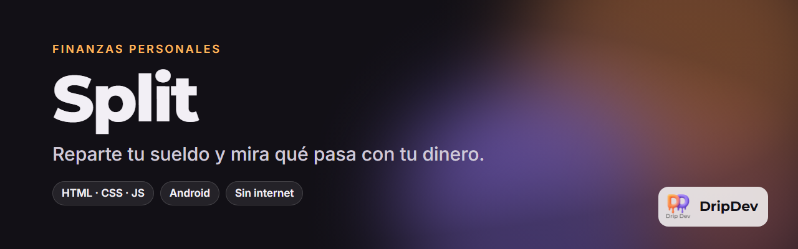

<p align="center">
  
</p>

<p align="center">
  <a href="https://github.com/roblesgg/split/releases/latest"></a>
  
  
  
</p>

**Split** es una app de finanzas personales que reparte tu sueldo por porcentajes, apunta lo que gastas e ingresas y te dice, sin rodeos, qué está pasando de verdad con tu dinero. Todo se queda en tu móvil: no hay cuentas, ni servidores, ni anuncios.

<!-- Capturas: añade las imágenes en docs/capturas/ y descomenta esta sección.
## Capturas
<p align="center">
  
  
  
  
</p>
-->

## Qué puedes hacer

- **Repartir el sueldo** en apartados por porcentaje: gastos fijos, ahorro, caprichos…
- **Apuntar un gasto en segundos**, con categorías y subcategorías que creas sobre la marcha.
- **Tu mes empieza cuando cobras.** Si cobras el 25, la app entera cuenta del 25 al 24.
- **Límites del mes** que avisan antes de pasarte, no después.
- **Varias cuentas** (banco, efectivo, ahorro) con traspasos entre ellas y metas de ahorro.
- **Pagos programados** para los recibos que se repiten.
- **Análisis** con histórico, proyección del mes y mapa de calor de tus gastos.
- **Widgets de Android**: saldo, límite más apurado y un botón para apuntar.
- **Privada de verdad**: funciona sin internet y los datos nunca salen del dispositivo.
- **Móvil y ordenador** con el mismo código: en pantalla grande se reorganiza en dos columnas.

## Descárgala

- **Android:** descarga `split.apk` de la [última versión](https://github.com/roblesgg/split/releases/latest) y ábrelo en el móvil. La app te avisa cuando hay una versión nueva.
- **Ordenador:** descarga el repositorio y abre `index.html` con doble clic.

## Hecho con

HTML, CSS y JavaScript puros. Sin build, sin npm, sin dependencias. El APK empaqueta la misma web (ver [`packaging/README.md`](packaging/README.md)).

## Desarrollo

Abre `index.html` en el navegador y listo. Si tu navegador bloquea el almacenamiento desde `file://`, sírvela por HTTP:

```bash
npx serve .
```

Cómo está pensada cada pantalla, cada cálculo y cada decisión de diseño: [`docs/DISENO.md`](docs/DISENO.md).

## Estado

En uso diario y con versiones nuevas cada poco.

---

<p align="center">
  <br>
  Un producto de <b>DripDev</b> · hecho por Álvaro Robles
</p>
